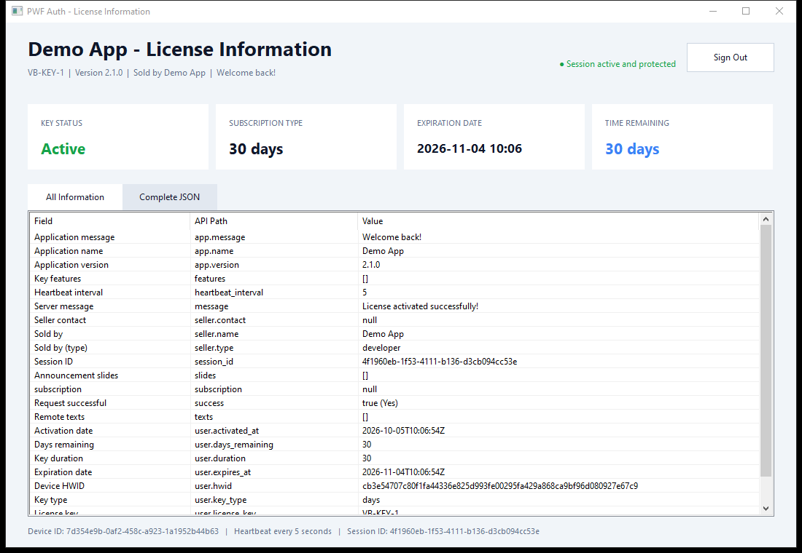
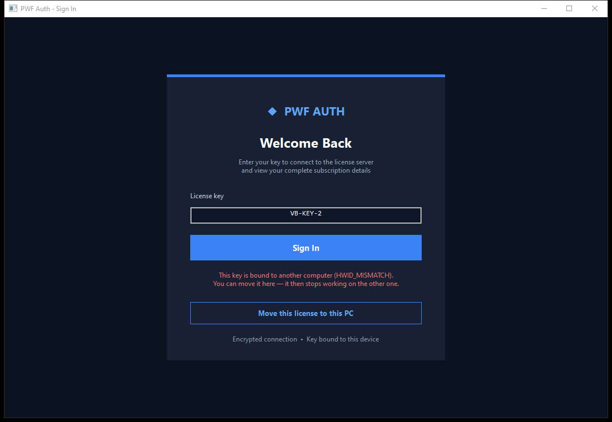

# PWF Auth Native C++ Desktop Sample

An English Windows desktop client written in native C++17. It mirrors the same
license flow as the C# and Python samples:

- encrypted license login and HWID binding;
- live heartbeat with server-driven session termination (the kill switch);
- moving a license to a new PC;
- complete license summary, flattened response table, and raw JSON;
- explicit logout that frees the server session.



The PWF Auth site does not publish a C++ package. This sample therefore implements
the documented protocol directly with Windows APIs:

- WinHTTP for HTTPS;
- Windows CNG for SHA-256, AES-256-CBC, HMAC-SHA256, and secure IV generation;
- the Windows cryptography `MachineGuid` for the hardware ID (the same value the
  .NET, Python and Node packages use, so one PC counts as one device);
- `nlohmann-json`, restored automatically through the included vcpkg manifest.

`PwfClient.h` / `PwfClient.cpp` are the reusable part: copy them into your own
application.

## What it shows

- **Sign in with a license key.** `Login` binds the key to this computer. The
  dashboard then shows the key's status, type, expiry and time left, who sold the
  key, and every field of the reply.
- **The kill switch.** `StartHeartbeat` runs after sign-in. When you ban, pause or
  reset the key in your dashboard, or it expires, the client calls the
  session-ended callback, and the app returns to the sign-in page with the reason.
  - Only an encrypted reply counts as an answer. Three beats in a row without one
    end the session with `NETWORK_LOST`, or with `CLOCK_SKEW` when the server kept
    refusing this computer's clock. Moving the PC clock therefore cannot keep a
    banned key running.
  - HTTP 429 has its own, larger budget (10 beats), because shared IPs get rate
    limited legitimately.
- **A wrong clock repairs itself.** When the server refuses a request because the
  PC's clock is more than five minutes off, it sends its own time. The client
  shifts its timestamps by the difference and sends the request once more.
- **Move a license to a new PC.** When the key is bound to another computer
  (`HWID_MISMATCH` or `DEVICE_LIMIT`), the sign-in page offers **Move this license
  to this PC**. This uses `ResetHardwareId`, then signs in again. The developer's
  cooldown applies between two moves (12 hours by default).

  

- **A fake server cannot sign in.** The license server encrypts every reply of the
  login, heartbeat and logout endpoints. A plain `{"success": true}` therefore came
  from a proxy, a hosts-file entry or a fake server: the client throws
  `PwfSecurityError` instead of signing in.
- **Clear errors** for no connection (`PwfNetworkError`), a refused application
  secret (HTTP 401) and a reply that is not the API's JSON (`PwfHttpError`).

## Configure

Replace the placeholder near the top of `main.cpp`:

```cpp
constexpr char APP_SECRET[] = "YOUR_64_CHARACTER_APP_SECRET";
```

Or set the `PWFAUTH_SECRET` environment variable, which takes precedence. The
program validates that the secret is a 64-character hexadecimal value before it
contacts the API. It remains in source only because this is an educational sample;
production applications should inject the secret during the build and obfuscate
release binaries. Never commit a real application secret or license key to the
repository.

Optional: to point the app at another server, such as a staging copy, set the
`PWFAUTH_BASE_URL` environment variable. When it is empty, the app uses
`https://pwfauth.com`.

## Build and run

Open `PWFAuthCpp.slnx` in Visual Studio, select `Debug | x64`, and press `F5`.
The project restores its vcpkg dependency locally during the first build.

The executable is written to:

```text
bin\Debug\PWFAuthCpp.exe
```

The application runs an offline AES/HMAC round-trip self-test before showing the
sign-in window. A real login still requires the application secret and a valid key.
